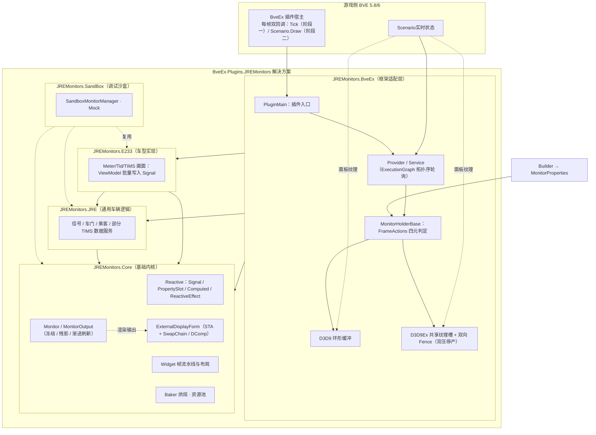

# JREMonitors 架构与帧流程

本文档描述 JREMonitors 的整体分层架构与单帧处理流程。

***

## 1. 总体概述

```text
BVE 每帧回调插件两次：
  阶段一（Tick）         将内容绘制进 D3D11 共享纹理：响应式 → 脏区 → 局部重绘
  阶段二（Scenario.Draw）将纹理投影至游戏 cab 面板并同步至外屏：投影 → 提交 → 同步
阶段一在游戏暂停时停止；阶段二在暂停时仍逐帧执行，但画面静止时只做判定而不产生渲染工作。
```

- **阶段一** 处理"内容如何变化"：响应式写入是唯一数据入口，按脏区驱动局部重绘，产物为 `MonitorOutput.OutputBitmap`。

- **阶段二** 处理"纹理如何上屏"：以 `ComputeFrameActions` 的四元判定（渲染 / 提交 / 同步 / 外屏同步）决定是否工作，静止时全部跳过。

两阶段以 `MonitorOutput.OutputBitmap`（D3D11 共享纹理）衔接。

***

## 2. 工程分层



| 工程 | 定位 | 说明 |
| --- | --- | --- |
| `JREMonitors.Core` | 基础内核 | 基于 `Vortice.Direct2D1` 的响应式 + 保留模式渲染引擎，内置画面按需更新、冻结检测、行扫描式渐进刷新及残影效果。 |
| `JREMonitors.JRE` | 通用车辆逻辑 | JR东日本系车辆通用逻辑。 |
| `JREMonitors.E233` | 车型实现 | E233 系的 UI 实现与业务逻辑。 |
| `JREMonitors.BveEx` | 框架适配层 | BveEx 适配：车辆多态配置解析、车辆服务适配、游戏内纹理显示与热重载（`MonitorHolder` 的投影/提交/同步）。 |
| `JREMonitors.SandBox` | 调试沙盒 | 独立调试入口，可离线预览 UI 与业务逻辑。 |

依赖关系自下而上：`Core` ← `JRE` ← `E233` ← `BveEx`，`SandBox` 独立于游戏运行。

分层约束：**Core 不感知车型与游戏**；**BveEx 负责对接 BVE 的每帧回调与 D3D9 侧**；**`ViewModel.OnUpdate`**
是响应式数据的唯一写入点；渲染期资源存于 `RenderContext.Properties`，领域服务与状态存于 `DataHub`（见 4.2）。

***

## 3. 一帧完整流程

```mermaid
flowchart TD
    subgraph TICK["阶段一：Tick（内容绘制，暂停时停止）"]
        T0["BVE Tick → PluginMain.Tick"]
        T0 --> R1["路由1：ExecutionGraph 拓扑序轮询"]
        T0 --> R2["路由2：DrawMonitors → DrawMonitorContent（生产背压判定）"]
        R2 --> P0{"IsProductionBlocked()?"}
        P0 -- " 是 " --> P1["跳过 Monitor.Draw，elapsed 计入 _pendingElapsed"]
        P0 -- " 否 " --> W1["Monitor.Draw：首帧预热 → 动态背景（脏时重渲）→ UpdateForeground"]
        W1 --> W2["Widget 流水线：ViewModel 批量写入 Signal（三阶段提交）"]
        W2 --> W3["WatchEffect → 脏标记 → CollectDirtyBounds → FrameCollector"]
        W3 --> W4["状态机：DrawImmediate → DrawDelayed → SyncDelayed（分片）→ BackToIdle"]
        W4 --> W5{"合成冻结？（无更新达到 GhostingDecayTime）"}
        W5 -- " 否 " --> W6["残影 GhostingEffect ping-pong EMA"]
        W5 -- " 是 " --> W7["该 Output 跳过合成段"]
        W6 --> OUT["OutputBitmap（D3D11 纹理）"]
        W7 --> OUT
    end

    subgraph DRW["阶段二：Scenario.Draw（投影+同步，暂停仍执行，静止仅判定）"]
        D0["SyncFrame：contentIsStatic = !ContentDrawnThisFrame"]
        D0 --> D1["ComputeFrameActions：effectiveFrozen / hasReason / ShouldSyncExternal"]
        D1 --> DG{"hasReason 为假？（零工作）"}
        DG -- " 是 " --> DX["跳过投影/提交/同步/Present"]
        DG -- " 否 " --> PRJ["cab 子链路：光照 → ProjectEffect 预畸变 → 写投影槽"]
        PRJ --> SB1{"Submit：D3D9 / D3D9Ex？"}
        SB1 -- " D3D9 " --> S1["环形缓冲 CopyResource 写槽"]
        SB1 -- " D3D9Ex " --> S2["共享槽 + 写侧 Fence"]
        S1 --> FL["单一 D3D11Context.Flush"]
        S2 --> FL
        FL --> SY{"Sync 三路径"}
        SY -- " D3D9 " --> Y1["Map 回读 → 行拷贝 → D3D9MergedTexture"]
        SY -- " D3D9Ex " --> Y2["TryAcquireDisplaySlot + StretchRectangle + 读侧 Fence"]
        SY -- " 外屏 " --> Y3["CopyResource → STA DoPresent → DComp"]
        Y1 --> GE["D3D9MergedTexture → PanelElement"]
        Y2 --> GE
        Y3 --> GE
        GE --> RE{"RenderExternal 判定"}
        RE -- " 跳过 " --> RD["不 Present"]
        RE -- " 刷新 " --> RP["NotifyFrameReady"]
    end
```



### 3.1 阶段一：Tick——内容绘制

1. **路由 1（状态轮询）**：`TickUpdateManager` 以 `ExecutionGraph` 拓扑序驱动各 `ITickUpdatable`
   （Provider/Service）。此路径只更新普通属性，响应式写入集中在组件的 ViewModel 中，保证写入点单一并可批量提交。
2. **路由 2（内容绘制）**：`DrawMonitors → DrawMonitorContent`：

   - **生产背压判定**：`IsProductionBlocked()`（D3D9Ex 写槽 fence 积压）为真时跳过 `Monitor.Draw`，elapsed 计入
     `_pendingElapsed`，背压解除后补回，画面保持上一完整帧。

   - `Monitor.Draw` 内部：预热（首帧两阶段）→ `HandleDynamicBackground`（动态背景仅在脏时重渲到各输出背景缓冲）→
     `UpdateForeground`（Widget 流水线）。

   - **Widget 流水线**（`Screen.UpdateForeground` 内）：`ViewModel.OnUpdate` 批量写入 `Signal/PropertySlot/ReactiveList`
     （包于 `ReactiveScope.BeginBatch/EndBatch` 三阶段提交：Commit→NotifyPending→FlushConsumers）→ `WatchEffect`
     求值产生脏标记（Layout/Visual）→ `CollectDirtyBounds` 沿树上报 `DirtyArea`（`RefreshSpeed=0` 立即，`>0` 延迟）至
     `FrameCollector`。

   - **状态机消费**：`MonitorDrawState` 依 `DrawImmediate → DrawDelayed → SyncDelayed（按刷新速度分片行扫描渐进）→ BackToIdle`
     消费脏区——立即脏区直接局部重绘，慢速内容在离屏渲染后分片同步。

   - **合成冻结**：`UpdateFreezeState` 累计无更新时长达到 `GhostingDecayTimeSeconds` 后置 `Frozen`，该 Output 于合成循环
     `continue`（`JustFrozen` 边沿帧除外）。Widget 更新流水线仍逐帧执行，冻结仅跳过合成。

   - **残影**：未冻结时经 `GhostingEffect` 双缓冲 ping-pong EMA 合成。

   - 产物：`MonitorOutput.OutputBitmap`（D3D11 纹理）。

### 3.2 阶段二：Scenario.Draw——投影与同步

1. **决策**：每个 Holder 的 `RenderCabProjectionFrame` 调用 `ComputeFrameActions`：

   - `effectiveFrozen = Frozen || contentIsStatic`，其中 `contentIsStatic = !ContentDrawnThisFrame`（本帧未绘制内容，暂停时等效）。

   - `hasReason = !blocked && (!effectiveFrozen || IsCabProjectionDirty || lightingChanged)`。

   - `ShouldRender = hasReason && Cab.Enabled`；`ShouldSubmit = ShouldSync = hasReason`；
     `ShouldSyncExternal = !blocked && !effectiveFrozen`（独立于 Submit，外屏只关注原始内容是否变化）。

   - `hasReason` 为假（零工作）时，不投影、不提交、不同步、不 Present。`IsCabProjectionDirty` 仅在 `ShouldSubmit`
     时清除，背压帧保留并在恢复后自动重渲。
2. **投影子链路**：
   `OutputBitmap → AdaptiveScreenLightingEffect（光照/亮度/圆角）→ ProjectEffect（H_correct = H_native⁻¹ ∘ H_total，将 UI 定位至纹理 t 位置，近正交采样避免斜向采样模糊）→ 写槽投影位图`
   。Mesh 顶点仅烘焙 RotZ，Tilt 交由 BVE 原生变换，覆盖目标四边形。
3. **Submit**：D3D9 走 `D3D9RingBuffer.Submit`（CopyResource 写槽、UnmappedCount+1）；D3D9Ex 走 `SubmitWriteSlot`（Event Query
   写侧 fence，跳过被读槽）。随后执行所有 Holder 统一的 `D3D11Context.Flush()`。
4. **Sync（三路径并行）**：

   - D3D9：Map 回读 staging → `LockRectangle(Discard)` → 行拷贝至 `D3D9MergedTexture`；

   - D3D9Ex：`TryAcquireDisplaySlot`（读侧 fence 非阻塞，未完成时回退上一槽）→ `StretchRectangle` → `MarkD3D9ExReadIssued`；

   - 外屏：`SyncExternalCopy` → CopyResource 至外屏共享纹理 → 外屏 STA 线程 `DoPresent` → SwapChain
     Present → DComp 合成。

   - 汇合：`DaytimeModel.Materials[0].Texture = D3D9MergedTexture`，由 `PanelElement` 渲染。
5. **RenderExternal 判定**：仅当 `Submitted`、`ExtFormNeedsSync`、亮度变化、`NeedsResize`、`!HasShownOnce`、
   `HasSyncedExternalThisFrame` 均不满足且已显示过时跳过 Present；否则 `NotifyFrameReady` 触发外屏刷新。

***

## 4. 关键机制

### 4.1 响应式内核（Core/Reactive）

- **`Signal<T>`**：可变值信号。ViewModel 暴露，`OnUpdate` 赋值；同值写入短路、不产生通知，批处理内缓冲。

- **`PropertySlot<T>`**：可读写/可绑定属性槽，Widget 状态载体；`CreatePropertySlot(DirtyType,…)` 使源失效时自动标记脏。

- **`Computed<T>`**：惰性派生值，读取 `Value` 才重算并做变值检测；适用于组合状态。

- **`ReactiveEffect`**：依赖追踪副作用；Widget 经 `WatchEffect(phase,…)` 三阶段挂接，Commit 阶段自动 Invalidate。

- **`ReactiveScope`**：CurrentSubscriber 依赖收集与 BeginBatch/EndBatch 三阶段提交。

### 4.2 两个容器的层级隔离

| 容器 | 所属层级 | 内容 | 生命周期 |
| --- | --- | --- | --- |
| `RenderContext.Properties`（即 `MonitorContext.Properties`） | 渲染层 | D2D 位图/笔刷、字体格式、Baker/笔刷缓存、TIMS 资源等 | 插件级共享；热重载时 `DisposeProperties` 清空 |
| `DataHub` | 领域层 | Provider/Service、共享状态、Scenario | 根 Hub + Monitor 本地 Hub，父链解析 |

约束：渲染期资源不入 `DataHub`，领域服务与状态不入 `Properties`。

### 4.3 双层冻结

- **合成冻结**（`Monitor.Draw` 内）：`UpdateFreezeState` 按 Output 累积无更新时长，达到 `GhostingDecayTime` 后跳过 D2D
  合成与残影。

- **投影冻结**（`ComputeFrameActions`）：`effectiveFrozen = Frozen || contentIsStatic` 决定投影/提交/同步/外屏同步是否工作。

两层相互独立且处于不同层级。

### 4.4 生产背压

- `DrawMonitorContent` 与 `ComputeFrameActions` 各含一道 `IsProductionBlocked` 检查。

- 依赖 D3D9Ex 写槽 fence（`IsNextWriteSlotPending`）；稳态无停产需 `BufferFrameCount ≥ MaxFrameLatency + 2`（限制 3~~7，对应游戏侧
  MaxFrameLatency 1~~5）。

### 4.5 热重载

- 配置文件保存即触发；`PluginMain.ApplyPendingReload` 区分 **FullRebuild**（`DisposeMonitorResources` →
  `DisposeProperties` 后整体重建）与 **ReconfigureSameVehicle**（`Reconfigure` + `ReconfigureMonitorLocal` 原地更新）。

- 构建期定型配置由 `ShouldFullRebuild(newConfig)` 判定，强制走 FullRebuild 以整体重建 UI 树与烘焙资源。

- D3D9/D3D9Ex 缓冲数变更走 `ReconfigureBufferFrameCount`，重建 ring/shared buffer 并重置 Sync 状态机。

***

## 5. 代码索引

| 关注点 | 位置 |
| --- | --- |
| 插件入口 / 热重载 | [PluginMain.cs](../JREMonitors.BveEx/PluginMain.cs) |
| 帧决策四元 / 投影 | [MonitorHolderBase.cs](../JREMonitors.BveEx/Monitors/MonitorHolderBase.cs) |
| D3D9 / D3D9Ex 提交同步 | [BveMonitorManagerD3D9.cs](../JREMonitors.BveEx/Monitors/BveMonitorManagerD3D9.cs) · [BveMonitorManagerD3D9Ex.cs](../JREMonitors.BveEx/Monitors/BveMonitorManagerD3D9Ex.cs) |
| Monitor 渲染 / 状态机 | [Monitor.cs](../JREMonitors.Core/Monitors/Monitor.cs) |
| 输出缓冲 / 冻结 / 残影 | [MonitorOutput.cs](../JREMonitors.Core/Monitors/MonitorOutput.cs) |
| Widget 帧流水线 | [Widget.cs](../JREMonitors.Core/Widgets/Widget.cs) |
| 响应式原语 | [Reactive/](../JREMonitors.Core/Reactive/) |
| 领域容器 | [DataHub.cs](../JREMonitors.Core/State/DataHub.cs) |
| 渲染资源容器 | [MonitorContext.cs](../JREMonitors.Core/Contexts/MonitorContext.cs) · [RenderContext.cs](../JREMonitors.Core/Contexts/RenderContext.cs) |
